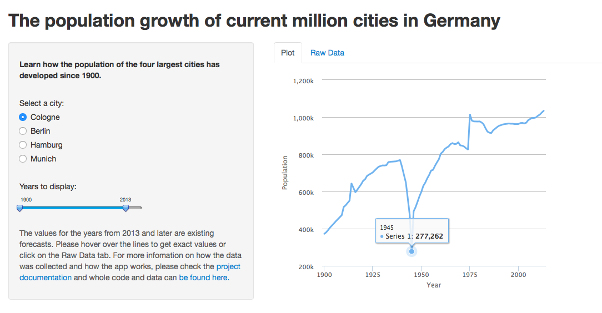

Developing Data Products
========================================================

#### The population growth of current million cities in Germany

[View the application](https://nierhoff.shinyapps.io/DDP_Shiny_Project/) 

Maximilian H. Nierhoff

November 2014


Introduction
========================================================

<small>The goal of this document is to briefly describe a web application that allows users to discover the population development of Cologne, Berlin, Hamburg and Munich from the year 1900 to the year 2030. These four cities are currently the only German cities with more than one million inhabitants.
  
The main challenge while building this app was to manually collect and aggregate the population figures.
If there was more than one value for one year for a city, the mean was taken for the regarding year.Therefore a list with the sources of the data:
* [Cologne](http://de.wikipedia.org/wiki/Einwohnerentwicklung_von_Köln)
* [Hamburg](http://de.wikipedia.org/wiki/Einwohnerentwicklung_von_Hamburg)
* [Berlin](http://de.wikipedia.org/wiki/Einwohnerentwicklung_von_Berlin)
* [Munich](http://de.wikipedia.org/wiki/Einwohnerentwicklung_von_München)</small>

Application Design
========================================================

<small>The respective numbers of inhabitants of the four cities can be selected using the radio buttons. Moreover, a desired data period can be specified by using the date slider.



You are able to check every data point of the plot by hovering over the line chart with your mouse. Further, you can check the raw data by clicking in the tab with the same name.</small>

Plot and Slider Computation
========================================================
<small>
The charts for the cities and also the regarding date slider gets computed by the following code:
```
output$plot <- renderChart2({
                selected <- input$city
                city <- subset(dat, city == selected & Year %in% seq(input$range[1], input$range[2], 1))
                h1 <- hPlot(
                        x = "Year", 
                        y = "Population", 
                        data = city, 
                        type = "line")
        })
```
Every time an other city gets selected the regarding data gets aggregated and displayed. Further if you change any position of the date slider the data gets re-aggregated or **reactivated**.
</small>

Installation and Use
========================================================

<small>The application can be accessed online on [RStudio's Shinyapp Server](https://nierhoff.shinyapps.io/DDP_Shiny_Project/) (recommended) or it can be downloaded from github and run on the user's computer.

To download the app from github please [follow this link](https://github.com/mhnierhoff/DDP_Shiny_Project).

#### Files to download
```
1. server.R
2. ui.R
3. data.csv
```
#### Running the App
Create a new directory and place the three files there. Open all files in your R IDE and enter the following lines on your R console.

```
library(shiny) 
runApp()
```
</small>
